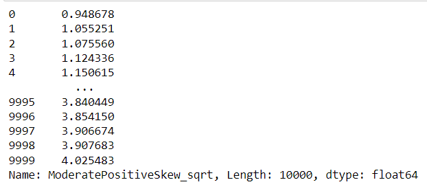
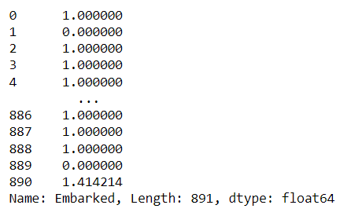
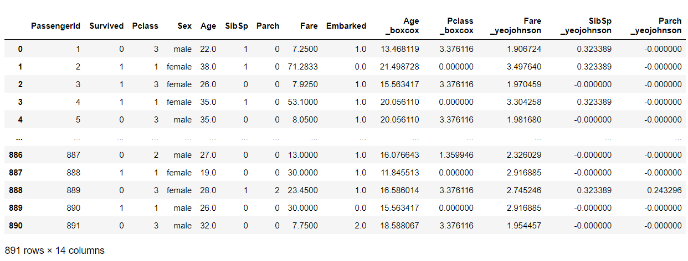

# EX-06-Feature-Transformation

## AIM
To Perform the various feature transformation techniques on a dataset and save the data to a file. 

## Explanation
Feature Transformation is a mathematical transformation in which we apply a mathematical formula to a particular column(feature) and transform the values which are useful for our further analysis.

 
## ALGORITHM
### STEP 1
Read the given Data
### STEP 2
Clean the Data Set using Data Cleaning Process
### STEP 3
Apply Feature Transformation techniques to all the feature of the data set
### STEP 4
Save the data to the file


## CODE
####  PROGRAMMED BY: SUBRAMANIYA PILLAI.B
#### REG NO: 212221230109 
### Data To Transform:
```
import pandas as pd  
import numpy as np  
import matplotlib.pyplot as plt  
import seaborn as sns  
import statsmodels.api as sm  
import scipy.stats as stats 
df=pd.read_csv("Data_to_Transform.csv")
df
df1=df.copy()
# log transformation
df1["ModeratePositiveSkew_log"] = np.log(df1.ModeratePositiveSkew)
df1.ModeratePositiveSkew_log
# reciprocal transformation
df1["HighlyPositiveSkew_recip"] = 1/df.HighlyPositiveSkew
df1.HighlyPositiveSkew_recip
#square transformation
df1["HighlyNegativeSkew_square"]= df1.HighlyNegativeSkew**(1/1.2)
df1.HighlyNegativeSkew_square
# square root transformation
df1['ModeratePositiveSkew_sqrt'] = np.sqrt(df.ModeratePositiveSkew)
df1.ModeratePositiveSkew_sqrt
# boxcox transforms
df1["HighlyPositiveSkew_boxcox"], parameters=stats.boxcox(df1.HighlyPositiveSkew)
df1.HighlyPositiveSkew_boxcox
df1["HighlyNegativeSkew_yeojohnson"], parameters=stats.yeojohnson(df1.HighlyNegativeSkew)
df1.HighlyNegativeSkew_yeojohnson#QUANTILE TRANSFORMATION:  
from sklearn.preprocessing import QuantileTransformer   
qt=QuantileTransformer(output_distribution='normal') 
df["Moderate Negative Skew_1"]=qt.fit_transform(df[["ModerateNegativeSkew"]])  
sm.qqplot(df['ModerateNegativeSkew'],line='45')  
plt.show()
sm.qqplot(df['Moderate Negative Skew_1'],line='45')  
plt.show()  
```
### titanic_dataset:
```
import pandas as pd  
import numpy as np  
import matplotlib.pyplot as plt  
import seaborn as sns  
import statsmodels.api as sm  
import scipy.stats as stats
df=pd.read_csv("titanic_dataset.csv")  
df 
df.drop("Name",axis=1,inplace=True)  
df.drop("Cabin",axis=1,inplace=True)  
df.drop("Ticket",axis=1,inplace=True)  
df.isnull().sum()
df["Age"]=df["Age"].fillna(df["Age"].median())  
df["Embarked"]=df["Embarked"].fillna(df["Embarked"].mode()[0])  
df.info()  
from sklearn.preprocessing import OrdinalEncoder
embark=["C","S","Q"]  
emb=OrdinalEncoder(categories=[embark])  
df["Embarked"]=emb.fit_transform(df[["Embarked"]])  
df
#FUNCTION TRANSFORMATION:  
#Log Transformation  
np.log(df["Fare"]) 
#ReciprocalTransformation 
np.reciprocal(df["Age"])
#Squareroot Transformation:  
np.sqrt(df["Embarked"])
#POWER TRANSFORMATION:  
df["Age _boxcox"], parameters=stats.boxcox(df["Age"])  
df  
df["Pclass _boxcox"], parameters=stats.boxcox(df["Pclass"])    
df 
df["Fare _yeojohnson"], parameters=stats.yeojohnson(df["Fare"])  
df 
df["SibSp _yeojohnson"], parameters=stats.yeojohnson(df["SibSp"])  
df  
df["Parch _yeojohnson"], parameters=stats.yeojohnson(df["Parch"])  
df
#QUANTILE TRANSFORMATION  
from sklearn.preprocessing import QuantileTransformer   
qt=QuantileTransformer(output_distribution='normal',n_quantiles=891)
df["Age_1"]=qt.fit_transform(df[["Age"]])  
sm.qqplot(df['Age'],line='45')  
plt.show() 
sm.qqplot(df['Age_1'],line='45')  
plt.show()  
df["Fare_1"]=qt.fit_transform(df[["Fare"]])  
sm.qqplot(df["Fare"],line='45')  
plt.show()  
sm.qqplot(df['Fare_1'],line='45')  
plt.show()
df.skew()
df  
```

# OUPUT
## Data to Transform

### log transformation

### reciprocal transformation

### square transformation

### squareroot transformation

### boxcox transformation

### yeojohnson transformation

### quantile transformation


## titanic_dataset


### Log transformation

### reciprocal transformation

### squareroot transformation

### boxcox transformation


### yeojohnson  transformation



### QUANTILE TRANSFORMATION 


# RESULT
Hence, Feature transformation techniques is been performed on given dataset and saved into a file successfully.